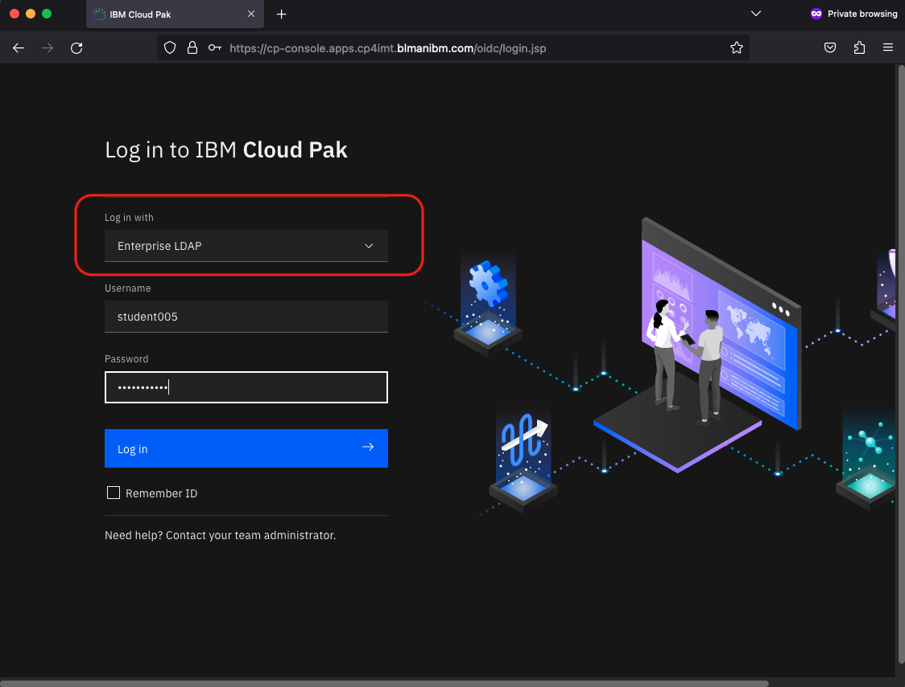
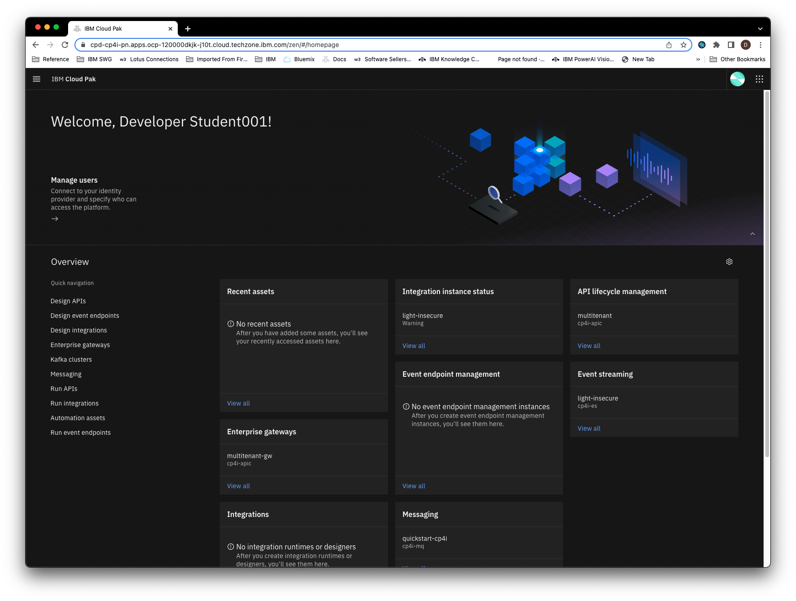
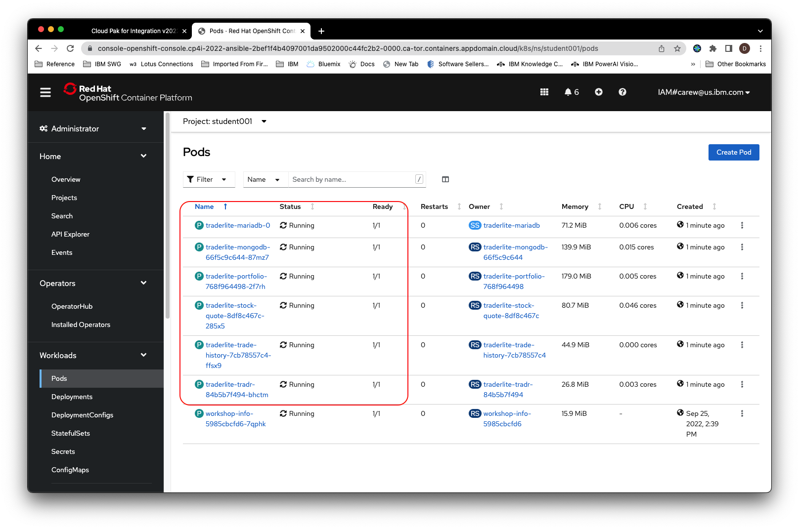

# Frequently Asked Questions & Helpful Tips / Tricks

1. [How do I get to the workshop OpenShift console?](#your-workshop-openshift-cluster-console)
1. [How do I get to the CP4I Platform Navigator?](#cp4i-platform-navigator)
1. [I don't have the TraderLite application, how can I install it?](#traderlite-application-installation)

>**Note:** You can click on any image in the instructions below to zoom in and see more details. When you do that just click on your browser's back button to return to the previous state.

***

## Your workshop OpenShift cluster console 

You will need to access the OpenShift console  to install applications used in the lab to interact with the CP4I components . Your instructor will provide you with a link . Click on the link for the  OpenShift console.

1. Select the **ldapidp** user repository

    

1. Enter the same username and password you used in the previous step and click on **Log in**.

1. Click on **Skip tour** when prompted 

    

1. Switch to the **Administrator** view 

    

1. Click on the link for the project with the same name as your username.

    

1. The OpenShift console should now look like the following image. Keep this browser tab open as you will need to use the OpenShift console during the labs

    

## CP4I Platform Navigator

The Cloud Pak for Integration Platform Navigator is a web based application that  allows you to access all the components in CP4I.  Your instructor will provider you with a URL for the CP4I  Platform Navigator and a username and password . You will need this link to access all  this CP4I components that you will use in the labs. We recommend that you keep it open in a separate tab. 

To log in to the  Platform Navigator do the following:

1.  Click on the link provided to you by your instructor for the Platforn Navigator:

1. Select the **Enterprise LDAP** user repository, enter your username and password and click on **Log in**

    

    >**Note:** You may have some browser warnings about self-signed certificates. If this happens, continue to the Platform Navigator page anyway. 

1. The will launch the CP4I Platform Navigator with links to all the various CP4I components. Keep this tab open for the rest of the workshop as it has all the information and links needed for you to complete the lab exercises.

    

## Traderlite Application Installation

The traderlite application used in this workshop is installed as part of the API Connect and/or the Salesforce integration labs. If you have not completed that lab, follow these steps to install an instance of the application.

1. In a separate browser tab, go to the OpenShift console of your workshop  cluster.

1. Click on **Projects** in the left navigation and then click on your ***student001*** project in the list.

    

1. Click on **Installed Operators** in the left navigation and then click on the **TraderLite Operator** in the list.

    

1. Click the **Create Instance** to start the installation of the TraderLite app.

    

1. Name the instance *traderlite* and leave everything else with their default values. Click **Create**

    

1. In the left navigation select **Pods** in the **Workloads** section and then wait for all the TraderLite pods to have a status of **Running** and be in the **Ready** state.

    > *Note: You can enter `traderlite` in the search by name input field to filter the pods.*

    

